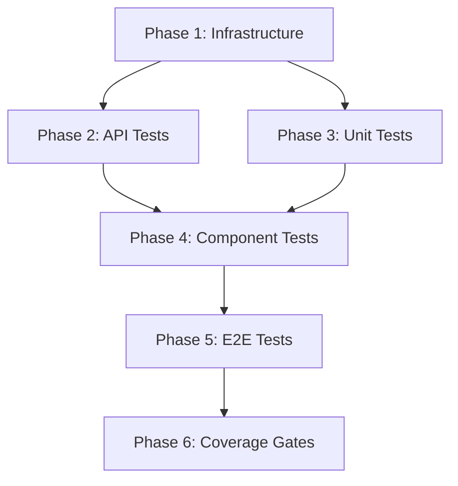

# ROADMAP.md — Testing Foundation

> **Project:** BeeHouse Sales Authorization System  
> **Focus:** Establish automated testing foundation  
> **Created:** 2026-01-19

## Overview

This roadmap focuses on establishing a comprehensive testing foundation for the BeeHouse application, which currently has **zero test coverage**. We'll implement unit tests, integration tests, and E2E tests incrementally, prioritizing critical paths first.

**Why Testing First?**
- Currently no safety net for refactoring
- Technical debt fixes require confidence
- Future features need regression protection
- Production system needs reliability guarantees

---

## Phase 1: Test Infrastructure Setup

**Goal:** Install and configure testing framework with basic examples

**Deliverables:**
- Jest + React Testing Library installed
- Test configuration files
- Example unit test
- Example integration test
- CI/CD test pipeline (GitHub Actions)

**Success Criteria:**
- `npm test` runs successfully
- At least 2 passing tests (1 unit, 1 integration)
- Tests run in CI on every push

**Estimated Effort:** 2-3 hours (AI execution time)

---

## Phase 2: API Route Testing

**Goal:** Test all 23 API endpoints with integration tests

**Deliverables:**
- Test utilities for Supabase mocking
- Test utilities for authentication
- Integration tests for:
  - Auth APIs (5 endpoints)
  - Empresas APIs (2 endpoints)
  - Imoveis APIs (2 endpoints)
  - Autorizações APIs (4 endpoints)
  - Bitrix24 APIs (7 endpoints)
  - ClickSign webhook (1 endpoint)
  - PDF generation (2 endpoints)

**Success Criteria:**
- All API endpoints have at least 1 happy path test
- All API endpoints have at least 1 error case test
- API test coverage >80%

**Estimated Effort:** 4-6 hours (AI execution time)

---

## Phase 3: Business Logic Unit Tests

**Goal:** Test critical business logic in isolation

**Deliverables:**
- Unit tests for:
  - Validation schemas (`lib/validations/*`)
  - PDF generation logic (`lib/pdf/*`)
  - Data formatters (`lib/utils/formatters.ts`, `currency.ts`, `cpf-cnpj.ts`)
  - Bitrix24 sync logic (`lib/bitrix/sync.ts`)

**Success Criteria:**
- All validation schemas have comprehensive tests
- All formatters test edge cases (null, invalid input)
- PDF generation logic tested with mock data
- Business logic coverage >85%

**Estimated Effort:** 3-4 hours (AI execution time)

---

## Phase 4: Component Testing

**Goal:** Test React components with React Testing Library

**Deliverables:**
- Component tests for:
  - Forms (10 components in `components/forms/`)
  - Lists (3 components in `components/lists/`)
  - UI components (7 components in `components/ui/`)
  - Selectors (2 components in `components/selectors/`)

**Success Criteria:**
- All form components test validation
- All list components test rendering with data
- All UI components test interactions
- Component coverage >70%

**Estimated Effort:** 4-5 hours (AI execution time)

---

## Phase 5: E2E Critical Flows

**Goal:** Test complete user workflows end-to-end

**Deliverables:**
- Playwright E2E testing setup
- E2E tests for:
  1. User authentication flow (Bitrix24 OAuth)
  2. Create empresa → Create imóvel → Create autorização
  3. Generate PDF from authorization
  4. Send authorization to ClickSign

**Success Criteria:**
- All 4 critical flows have E2E tests
- E2E tests run in CI
- Tests use test database (not production)

**Estimated Effort:** 3-4 hours (AI execution time)

---

## Phase 6: Test Coverage & Quality Gates

**Goal:** Establish coverage thresholds and quality enforcement

**Deliverables:**
- Coverage reporting with NYC/Istanbul
- Coverage thresholds in Jest config:
  - Statements: 75%
  - Branches: 70%
  - Functions: 75%
  - Lines: 75%
- Pre-commit hooks for test execution
- CI fails if coverage drops below threshold

**Success Criteria:**
- Overall test coverage >75%
- All PRs require passing tests
- Coverage report generated on every CI run

**Estimated Effort:** 2-3 hours (AI execution time)

---

## Execution Order

### Wave 1 (Foundation)
- Phase 1: Test Infrastructure Setup

### Wave 2 (Core Testing)
- Phase 2: API Route Testing
- Phase 3: Business Logic Unit Tests
(Can run in parallel — different file sets)

### Wave 3 (UI & Integration)
- Phase 4: Component Testing

### Wave 4 (End-to-End)
- Phase 5: E2E Critical Flows

### Wave 5 (Quality Gates)
- Phase 6: Test Coverage & Quality Gates

---

## Dependencies

---

## Out of Scope (Future Work)

- Visual regression testing (Chromatic, Percy)
- Performance testing (Lighthouse CI)
- Load testing for API endpoints
- Security testing (OWASP ZAP)
- Accessibility testing (axe-core)

These can be added after basic testing foundation is solid.

---

## Measurement & Success

### Phase Completion Criteria
Each phase is considered complete when:
- [ ] All deliverables created
- [ ] All success criteria met
- [ ] Tests pass in CI
- [ ] Code committed to git

### Overall Success Metrics
- ✅ Test coverage >75%
- ✅ All critical paths tested (E2E)
- ✅ CI pipeline fails on test failures
- ✅ Zero flaky tests
- ✅ Test execution time <60 seconds (unit + integration)
- ✅ E2E tests <5 minutes

---

## Risk Mitigation

| Risk | Mitigation |
|------|------------|
| Tests take too long | Parallel execution, mock external APIs |
| Flaky E2E tests | Retry logic, stable selectors, test isolation |
| Hard to mock Supabase | Use Supabase test client with test database |
| Hard to mock Bitrix24 | MSW (Mock Service Worker) for API mocking |
| Breaking existing features | Run tests before every commit |

---

**Next Step:** Run `/plan` to create detailed execution plans for Phase 1
