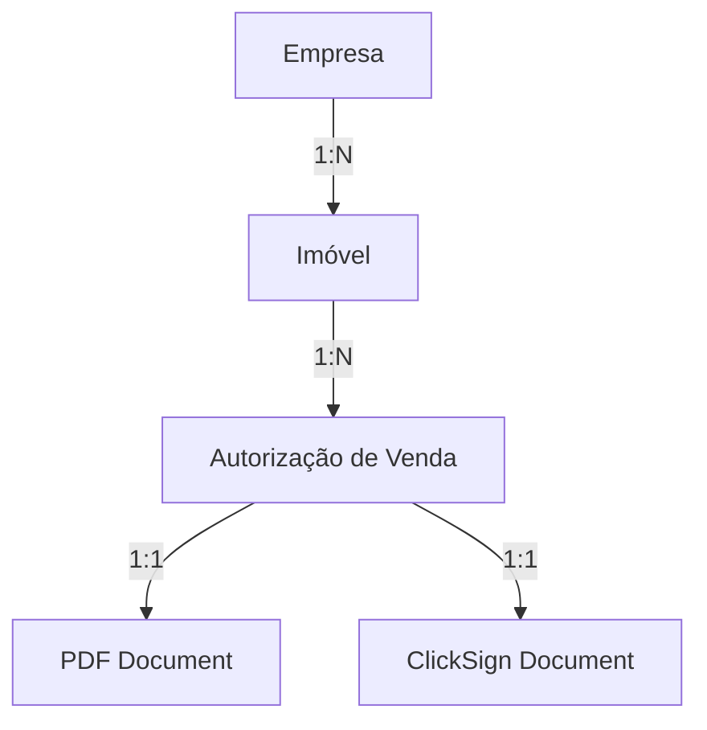

# Implementation Plan: Business Logic Refactoring for ClickSign Integration

> [!NOTE]
> **Working Directory**: `c:\Users\beeho\Desktop\beehouse-pdf-app`  
> **Architecture**: Hybrid (Supabase PostgreSQL + Bitrix24 Sync)  
> **Authentication**: Supabase Auth with JWT and row-level security

## Problem Analysis

The current system has a **flawed business logic** that prevents proper ClickSign API v3 integration:

### Current Issues
1. **No database persistence**: The system only generates PDFs directly without storing structured data
2. **Flat data structure**: All form data is processed in a single level without relationships
3. **No entity management**: Cannot create and manage Empresas, Imóveis, and Autorizações separately
4. **Direct PDF generation**: The workflow goes from form → PDF, skipping proper data modeling

### Required Business Logic

The correct hierarchy should be:



### Permission Requirements

- **User-level isolation**: Each broker/user can only see their own Empresas/Imóveis/Autorizações
- **Admin access**: Admins can see all records
- **Bitrix24 sync**: Admin-only view in Bitrix24 CRM (regular users never access Bitrix24)

## Architecture Decision: Hybrid Approach

### Why Not CRM-as-Database?

Using Bitrix24 API directly as database has critical flaws:
- ❌ Slow performance (multiple API calls per page)
- ❌ No row-level permissions (all users see all companies)
- ❌ Cannot support ClickSign integration properly
- ❌ API rate limits
- ❌ Complex relationship queries are difficult

### Hybrid Solution

**Supabase PostgreSQL** (Primary Source of Truth)
- Managed PostgreSQL with fast queries and complex joins
- Built-in Row-level security (RLS) for user isolation
- Full control over schema via SQL Editor
- Support for ClickSign webhooks and state management
- Integrated authentication (Supabase Auth)
- Built-in Storage for PDFs
- Auto-generated REST APIs

**Bitrix24 CRM** (Admin Dashboard & Backup)
- Sync data one-way: Your App → Bitrix24
- Admin-only visibility
- Track `bitrix_company_id` and `bitrix_deal_id` for reference

## Database Schema

### Users Table

```sql
CREATE TABLE users (
    id SERIAL PRIMARY KEY,
    email VARCHAR(255) UNIQUE NOT NULL,
    password_hash VARCHAR(255) NOT NULL,
    name VARCHAR(255),
    role VARCHAR(50) DEFAULT 'broker' CHECK (role IN ('admin', 'broker')),
    bitrix_user_id INTEGER,
    created_at TIMESTAMP DEFAULT CURRENT_TIMESTAMP,
    updated_at TIMESTAMP DEFAULT CURRENT_TIMESTAMP
);

CREATE INDEX idx_users_email ON users(email);
CREATE INDEX idx_users_role ON users(role);
```

### Empresas Table

```sql
CREATE TABLE empresas (
    id SERIAL PRIMARY KEY,
    created_by_user_id INTEGER NOT NULL REFERENCES users(id) ON DELETE CASCADE,
    bitrix_company_id INTEGER UNIQUE,
    
    tipo VARCHAR(10) NOT NULL CHECK (tipo IN ('PF', 'PJ')),
    
    -- PF fields
    nome VARCHAR(255),
    cpf VARCHAR(14) UNIQUE,
    rg VARCHAR(20),
    profissao VARCHAR(100),
    estado_civil VARCHAR(50),
    regime_casamento VARCHAR(100),
    endereco TEXT,
    email VARCHAR(255),
    telefone VARCHAR(20),
    
    -- Cônjuge (if applicable)
    conjuge_nome VARCHAR(255),
    conjuge_cpf VARCHAR(14),
    conjuge_rg VARCHAR(20),
    conjuge_profissao VARCHAR(100),
    conjuge_email VARCHAR(255),
    
    -- PJ fields
    razao_social VARCHAR(255),
    cnpj VARCHAR(18) UNIQUE,
    inscricao_estadual VARCHAR(50),
    inscricao_municipal VARCHAR(50),
    endereco_sede TEXT,
    
    -- Representante Legal (for PJ)
    rep_legal_nome VARCHAR(255),
    rep_legal_cpf VARCHAR(14),
    rep_legal_cargo VARCHAR(100),
    
    created_at TIMESTAMP DEFAULT CURRENT_TIMESTAMP,
    updated_at TIMESTAMP DEFAULT CURRENT_TIMESTAMP,
    last_synced_to_bitrix TIMESTAMP,
    
    CHECK (
        (tipo = 'PF' AND cpf IS NOT NULL) OR
        (tipo = 'PJ' AND cnpj IS NOT NULL)
    )
);

CREATE INDEX idx_empresas_created_by ON empresas(created_by_user_id);
CREATE INDEX idx_empresas_bitrix ON empresas(bitrix_company_id);
CREATE INDEX idx_empresas_cpf ON empresas(cpf);
CREATE INDEX idx_empresas_cnpj ON empresas(cnpj);

-- Row-level security
ALTER TABLE empresas ENABLE ROW LEVEL SECURITY;

CREATE POLICY empresas_user_isolation ON empresas
    FOR ALL
    USING (
        created_by_user_id = current_setting('app.current_user_id')::INTEGER
        OR EXISTS (SELECT 1 FROM users WHERE id = current_setting('app.current_user_id')::INTEGER AND role = 'admin')
    );
```

### Imóveis Table

```sql
CREATE TABLE imoveis (
    id SERIAL PRIMARY KEY,
    empresa_id INTEGER NOT NULL REFERENCES empresas(id) ON DELETE CASCADE,
    created_by_user_id INTEGER NOT NULL REFERENCES users(id) ON DELETE CASCADE,
    bitrix_deal_id INTEGER UNIQUE,
    
    descricao TEXT NOT NULL,
    endereco TEXT NOT NULL,
    matricula VARCHAR(100),
    valor DECIMAL(15, 2) NOT NULL,
    
    admin_condominio VARCHAR(255),
    valor_condominio DECIMAL(15, 2),
    chamada_capital VARCHAR(50),
    num_parcelas INTEGER,
    
    created_at TIMESTAMP DEFAULT CURRENT_TIMESTAMP,
    updated_at TIMESTAMP DEFAULT CURRENT_TIMESTAMP,
    last_synced_to_bitrix TIMESTAMP
);

CREATE INDEX idx_imoveis_empresa ON imoveis(empresa_id);
CREATE INDEX idx_imoveis_created_by ON imoveis(created_by_user_id);
CREATE INDEX idx_imoveis_bitrix ON imoveis(bitrix_deal_id);

-- Row-level security
ALTER TABLE imoveis ENABLE ROW LEVEL SECURITY;

CREATE POLICY imoveis_user_isolation ON imoveis
    FOR ALL
    USING (
        created_by_user_id = current_setting('app.current_user_id')::INTEGER
        OR EXISTS (SELECT 1 FROM users WHERE id = current_setting('app.current_user_id')::INTEGER AND role = 'admin')
    );
```

### Autorizações de Venda Table

```sql
CREATE TABLE autorizacoes_vendas (
    id SERIAL PRIMARY KEY,
    imovel_id INTEGER NOT NULL REFERENCES imoveis(id) ON DELETE CASCADE,
    created_by_user_id INTEGER NOT NULL REFERENCES users(id) ON DELETE CASCADE,
    
    -- Contract terms
    prazo_exclusividade INTEGER DEFAULT 0,
    comissao_percentual DECIMAL(5, 2) DEFAULT 6.00,
    
    -- Status workflow
    status VARCHAR(50) DEFAULT 'rascunho' CHECK (status IN (
        'rascunho', 
        'aguardando_assinatura',
        'assinado',
        'cancelado',
        'encerrado'
    )),
    
    -- ClickSign integration
    clicksign_document_key VARCHAR(255) UNIQUE,
    clicksign_status VARCHAR(50),
    clicksign_request_signature_key VARCHAR(255),
    
    -- PDF storage
    pdf_url TEXT,
    pdf_filename VARCHAR(255),
    
    created_at TIMESTAMP DEFAULT CURRENT_TIMESTAMP,
    updated_at TIMESTAMP DEFAULT CURRENT_TIMESTAMP,
    signed_at TIMESTAMP,
    expires_at TIMESTAMP
);

CREATE INDEX idx_autorizacoes_imovel ON autorizacoes_vendas(imovel_id);
CREATE INDEX idx_autorizacoes_created_by ON autorizacoes_vendas(created_by_user_id);
CREATE INDEX idx_autorizacoes_status ON autorizacoes_vendas(status);
CREATE INDEX idx_autorizacoes_clicksign ON autorizacoes_vendas(clicksign_document_key);

-- Row-level security
ALTER TABLE autorizacoes_vendas ENABLE ROW LEVEL SECURITY;

CREATE POLICY autorizacoes_user_isolation ON autorizacoes_vendas
    FOR ALL
    USING (
        created_by_user_id = current_setting('app.current_user_id')::INTEGER
        OR EXISTS (SELECT 1 FROM users WHERE id = current_setting('app.current_user_id')::INTEGER AND role = 'admin')
    );
```

## Backend API Routes

### Authentication (`/api/auth/*`)

**POST /api/auth/register**
- Create new user account
- Hash password with bcrypt
- Return JWT token

**POST /api/auth/login**
- Validate credentials
- Return JWT token with user info

**GET /api/auth/me**
- Return current user info from JWT

### Empresas (`/api/empresas/*`)

**GET /api/empresas**
- List all empresas for current user (or all if admin)
- Support query params: `?tipo=PF|PJ`, `?search=name`
- Return empresas with count of linked imóveis

**GET /api/empresas/:id**
- Get single empresa with all details
- Include linked imóveis list

**POST /api/empresas**
- Create new empresa
- Validate based on tipo (PF vs PJ required fields)
- Sync to Bitrix24 immediately
- Set `created_by_user_id` from JWT

**PUT /api/empresas/:id**
- Update empresa
- Check user owns it (or is admin)
- Sync changes to Bitrix24

**DELETE /api/empresas/:id**
- Soft delete or hard delete (cascades to imóveis and autorizações)
- Check user owns it (or is admin)

### Imóveis (`/api/imoveis/*`)

**GET /api/imoveis**
- List all imóveis for current user
- Support filter: `?empresa_id=123`
- Return with empresa info joined

**GET /api/imoveis/:id**
- Get single imóvel with empresa and autorizações

**POST /api/imoveis**
- Create new imóvel
- Validate `empresa_id` exists and user has access
- Sync to Bitrix24 as Deal
- Set `created_by_user_id` from JWT

**PUT /api/imoveis/:id**
- Update imóvel
- Check ownership

**DELETE /api/imoveis/:id**
- Delete imóvel (cascades to autorizações)

### Autorizações (`/api/autorizacoes/*`)

**GET /api/autorizacoes**
- List all autorizações for current user
- Support filters: `?status=rascunho`, `?imovel_id=123`
- Return with full joined data (autorização → imóvel → empresa)

**GET /api/autorizacoes/:id**
- Get complete autorização with all related data

**POST /api/autorizacoes**
- Create new autorização
- Validate `imovel_id` exists and user has access
- Generate expiration date based on `prazo_exclusividade`
- Status starts as 'rascunho'

**PUT /api/autorizacoes/:id**
- Update autorização
- Cannot update if status is 'assinado'

**POST /api/autorizacoes/:id/generate-pdf**
- Generate PDF using existing `generate-pdf.js` logic
- Fetch full data from database
- Store PDF URL in database
- Return PDF for download

**POST /api/autorizacoes/:id/send-to-clicksign**
- Generate PDF if not exists
- Upload to ClickSign API v3
- Add signers (empresa contacts + Beehouse)
- Create signature list
- Store `clicksign_document_key`
- Update status to 'aguardando_assinatura'

**DELETE /api/autorizacoes/:id**
- Delete autorização
- Cannot delete if status is 'assinado'

### ClickSign Webhook (`/api/clicksign/webhook`)

**POST /api/clicksign/webhook**
- Receive ClickSign event notifications
- Verify webhook signature
- Handle events:
  - `document.signed`: Update status to 'assinado', set `signed_at`
  - `document.canceled`: Update status to 'cancelado'
  - `signer.signed`: Log individual signer actions

### Bitrix24 Sync (`/api/bitrix/sync`)

**POST /api/bitrix/sync/empresa/:id**
- Manually trigger sync of empresa to Bitrix24
- Create or update Company record
- Store `bitrix_company_id`

**POST /api/bitrix/sync/imovel/:id**
- Manually trigger sync of imóvel to Bitrix24
- Create or update Deal record
- Store `bitrix_deal_id`

## Frontend Structure

### Authentication Pages

**`/login.html`**
- Email + password form
- Store JWT in localStorage
- Redirect to dashboard

**`/register.html`**
- New user registration
- Auto-login after registration

### Main Application

**`/dashboard.html`**
- Overview of user's data:
  - Total empresas, imóveis, autorizações
  - Recent autorizações list
  - Quick actions

**`/empresas.html`**
- List all empresas (table/cards)
- Search and filter (PF/PJ)
- Create new empresa (modal or separate page)
- Edit/delete actions
- Click empresa → view linked imóveis

**`/empresa-form.html`**
- Dynamic form that toggles fields based on tipo (PF/PJ)
- Validation for CPF/CNPJ
- Cônjuge section (appears for PF Casado)
- Representative Legal section (appears for PJ)

**`/imoveis.html`**
- List all imóveis
- Filter by empresa
- Create new imóvel (empresa dropdown)
- Edit/delete actions
- Click imóvel → view autorizações

**`/imovel-form.html`**
- Select empresa (dropdown with search)
- Property fields (endereço, valor, matrícula, etc.)

**`/autorizacoes.html`**
- List all autorizações
- Filter by status, empresa, imóvel
- Status badges (rascunho, aguardando, assinado)
- Actions per status:
  - Rascunho: Edit, Generate PDF, Send to ClickSign, Delete
  - Aguardando: View PDF, Cancel
  - Assinado: View PDF, Download signed version

**`/autorizacao-form.html`**
- **Step 1**: Select existing Empresa (or create new)
- **Step 2**: Select existing Imóvel from that Empresa (or create new)
- **Step 3**: Configure authorization terms:
  - Prazo de exclusividade (days)
  - Comissão percentual
- Preview selected empresa + imóvel data
- Actions:
  - Save as Draft
  - Generate PDF
  - Send to ClickSign

### Navigation

**Navbar (all pages)**
- Logo + App name
- Links: Dashboard | Empresas | Imóveis | Autorizações
- User menu: Profile | Logout
- If admin: Link to Bitrix24

## ClickSign API v3 Integration

### Document Creation Flow

1. **Generate PDF**: Use existing `generate-pdf.js` with data from database
2. **Upload to ClickSign**:
   ```javascript
   POST https://app.clicksign.com/api/v1/documents
   Headers: Authorization: Bearer YOUR_API_TOKEN
   Body: {
     "document": {
       "path": "/Autorizacoes/autorizacao-{id}.pdf",
       "content_base64": "{base64_pdf}",
       "deadline_at": "{expires_at}",
       "auto_close": true,
       "locale": "pt-BR"
     }
   }
   ```

3. **Add Signers**:
   ```javascript
   POST https://app.clicksign.com/api/v1/signers
   Body: {
     "signer": {
       "email": "{empresa_email}",
       "phone_number": "{empresa_telefone}",
       "name": "{empresa_nome}",
       "documentation": "{cpf_or_cnpj}",
       "birthday": "{if_available}",
       "has_documentation": true,
       "selfie_enabled": false,
       "handwritten_enabled": false,
       "official_document_enabled": false,
       "liveness_enabled": false
     }
   }
   ```

4. **Create Signature List**:
   ```javascript
   POST https://app.clicksign.com/api/v1/lists
   Body: {
     "list": {
       "document_key": "{clicksign_document_key}",
       "signers": [
         {"key": "{empresa_signer_key}", "sign_as": "sign"},
         {"key": "{beehouse_signer_key}", "sign_as": "sign"}
       ]
     }
   }
   ```

5. **Store keys** in database and update status

### Webhook Configuration

**Webhook URL**: `https://your-domain.vercel.app/api/clicksign/webhook`

**Events to subscribe**:
- `document.signed`
- `document.canceled`
- `signer.signed`

**Webhook verification**:
```javascript
const crypto = require('crypto');

function verifyWebhook(body, signature, secret) {
    const hash = crypto
        .createHmac('sha256', secret)
        .update(JSON.stringify(body))
        .digest('hex');
    return hash === signature;
}
```

## Bitrix24 Sync Implementation

### Sync Empresa → Bitrix24 Company

```javascript
async function syncEmpresaToBitrix(empresa) {
    const bitrix = require('./utils/b24');
    
    const companyData = {
        TITLE: empresa.tipo === 'PJ' ? empresa.razao_social : empresa.nome,
        COMPANY_TYPE: empresa.tipo === 'PJ' ? 'COMPANY' : 'INDIVIDUAL',
        PHONE: [{ VALUE: empresa.telefone, VALUE_TYPE: 'WORK' }],
        EMAIL: [{ VALUE: empresa.email, VALUE_TYPE: 'WORK' }],
        ADDRESS: empresa.tipo === 'PJ' ? empresa.endereco_sede : empresa.endereco
    };
    
    // Add custom fields for CPF/CNPJ
    if (empresa.tipo === 'PF') {
        companyData['UF_CRM_CPF'] = empresa.cpf; // Replace with your actual field ID
    } else {
        companyData['UF_CRM_CNPJ'] = empresa.cnpj;
    }
    
    let result;
    if (empresa.bitrix_company_id) {
        // Update existing
        result = await bitrix.call('crm.company.update', {
            id: empresa.bitrix_company_id,
            fields: companyData
        });
    } else {
        // Create new
        result = await bitrix.call('crm.company.add', {
            fields: companyData
        });
        
        // Store bitrix_company_id in database
        await db.query(
            'UPDATE empresas SET bitrix_company_id = $1, last_synced_to_bitrix = NOW() WHERE id = $2',
            [result.id, empresa.id]
        );
    }
    
    return result;
}
```

### Sync Imóvel → Bitrix24 Deal

```javascript
async function syncImovelToBitrix(imovel, empresa) {
    const bitrix = require('./utils/b24');
    
    const dealData = {
        TITLE: `${imovel.descricao} - ${empresa.tipo === 'PJ' ? empresa.razao_social : empresa.nome}`,
        COMPANY_ID: empresa.bitrix_company_id,
        OPPORTUNITY: imovel.valor,
        CURRENCY_ID: 'BRL',
        COMMENTS: `Endereço: ${imovel.endereco}\nMatrícula: ${imovel.matricula || 'N/A'}`
    };
    
    let result;
    if (imovel.bitrix_deal_id) {
        result = await bitrix.call('crm.deal.update', {
            id: imovel.bitrix_deal_id,
            fields: dealData
        });
    } else {
        result = await bitrix.call('crm.deal.add', {
            fields: dealData
        });
        
        await db.query(
            'UPDATE imoveis SET bitrix_deal_id = $1, last_synced_to_bitrix = NOW() WHERE id = $2',
            [result.id, imovel.id]
        );
    }
    
    return result;
}
```

## Implementation Checklist

### Phase 1: Database & Auth Setup
- [ ] Create Supabase project at https://supabase.com/dashboard
- [ ] Run schema migrations via Supabase SQL Editor (users, empresas, imoveis, autorizacoes_vendas)
- [ ] Configure Row Level Security (RLS) policies
- [ ] Set up Supabase Auth (email/password)
- [ ] Create Storage bucket for PDFs (`autorizacoes-pdfs`)
- [ ] Install Supabase client libraries (`@supabase/supabase-js`, `@supabase/auth-helpers-nextjs`)
- [ ] Generate TypeScript types: `npx supabase gen types typescript --project-id <ID> > types/database.ts`
- [ ] Create auth endpoints (register, login, me) using Supabase Auth
- [ ] Test row-level security policies

### Phase 2: Core API Routes
- [ ] Create `/api/empresas` CRUD endpoints
- [ ] Create `/api/imoveis` CRUD endpoints
- [ ] Create `/api/autorizacoes` CRUD endpoints
- [ ] Add validation with Zod schemas
- [ ] Test all endpoints with Postman/Thunder Client

### Phase 3: PDF & ClickSign Integration
- [ ] Update `/api/generate-pdf` to accept autorizacao_id
- [ ] Implement `/api/autorizacoes/:id/generate-pdf`
- [ ] Integrate ClickSign document upload
- [ ] Implement signer addition
- [ ] Create signature list
- [ ] Build webhook handler `/api/clicksign/webhook`
- [ ] Test complete ClickSign flow

### Phase 4: Bitrix24 Sync
- [ ] Implement empresa → Bitrix24 Company sync
- [ ] Implement imóvel → Bitrix24 Deal sync
- [ ] Add sync triggers on create/update
- [ ] Create manual sync endpoints
- [ ] Test bidirectional reference (store bitrix IDs)

### Phase 5: Frontend UI
- [ ] Build login/register pages
- [ ] Create dashboard overview
- [ ] Build empresas list & form (PF/PJ toggle)
- [ ] Build imóveis list & form (empresa dropdown)
- [ ] Build autorizações list with status filters
- [ ] Create multi-step autorização form (empresa → imóvel → terms)
- [ ] Add action buttons (Generate PDF, Send to ClickSign)
- [ ] Implement navigation and auth guards

### Phase 6: Testing & Deployment
- [ ] Test complete user flow (register → create empresa → create imóvel → create autorização → sign)
- [ ] Test admin vs regular user permissions
- [ ] Verify Bitrix24 sync accuracy
- [ ] Test ClickSign webhooks in production
- [ ] Deploy to Vercel
- [ ] Configure environment variables
- [ ] Set up ClickSign webhook URL

## Environment Variables Required

```bash
# Supabase
NEXT_PUBLIC_SUPABASE_URL=https://your-project.supabase.co
NEXT_PUBLIC_SUPABASE_ANON_KEY=your-anon-key
SUPABASE_SERVICE_ROLE_KEY=your-service-role-key

# Bitrix24
BITRIX24_DOMAIN=yourcompany.bitrix24.com.br
BITRIX24_CLIENT_ID=...
BITRIX24_CLIENT_SECRET=...
BITRIX24_WEBHOOK_URL=https://yourcompany.bitrix24.com.br/rest/...

# ClickSign
CLICKSIGN_API_TOKEN=your-clicksign-api-token
CLICKSIGN_WEBHOOK_SECRET=your-webhook-secret

# App
NEXT_PUBLIC_APP_URL=https://your-app.vercel.app
```

## Success Criteria

✅ Users can register and login  
✅ Users can create/edit/delete Empresas (PF and PJ)  
✅ Users can create/edit/delete Imóveis linked to Empresas  
✅ Users can create Autorizações linked to Imóveis  
✅ Row-level security: users only see their own data  
✅ Admins can see all data  
✅ PDF generation works from database data  
✅ ClickSign integration sends documents and tracks signatures  
✅ Webhook updates autorização status on signing  
✅ Bitrix24 sync creates/updates Companies and Deals  
✅ Admins can view all data in Bitrix24 CRM
